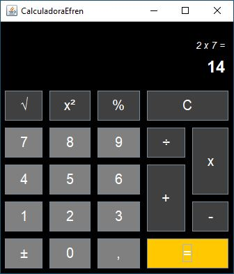

# Calculadora

Este es un programa de calculadora desarrollado en Java que utiliza la biblioteca Swing para la interfaz gráfica de usuario.

## Funcionalidades

La calculadora ofrece las siguientes funcionalidades:

- Operaciones básicas: suma, resta, multiplicación y división.
- Operaciones adicionales: raíz cuadrada, elevar al cuadrado y porcentaje.
- Cambio de signo.
- Borrar la pantalla y reiniciar la calculadora.

## Interfaz

